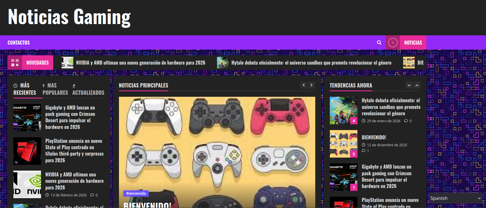
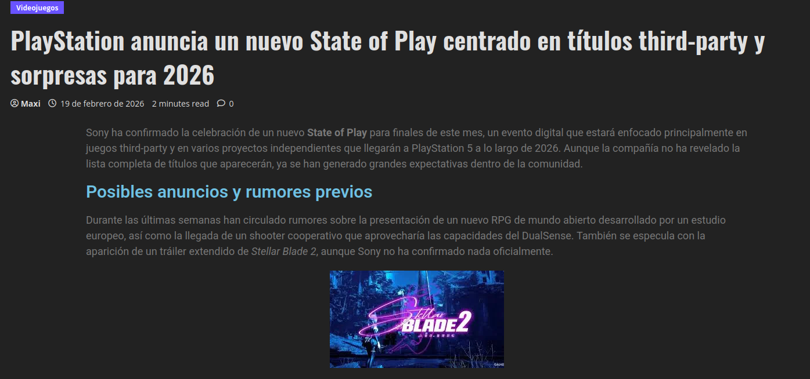

# Practica-Tema-3---Instalalacion-Configuracion-de-WordPress

## 1. Descripción del proyecto

Para realizar este proyecto he desarrollado una página web para gente que quiera enterarse de las novedades en el mundo tanto de la tecnologia como para los videojuegos **“Noticias Gaming”**, utilizando **WordPress**. El objetivo principal era crear un sitio web funcional donde se puedan publicar y consultar cosas relacionadas con Componentes y videojuegos.

## 2. Instalación y configuración

En primer lugar, instalé **LAMP** y luego instalé **Wordpress**. Después seleccioné un tema visual adecuado. que permite mostrar la información de forma clara y atractiva.

Posteriormente personalicé el diseño del portal modificando diferentes elementos como el menú de navegación, los colores principales, la estructura de la página de inicio y las distintas secciones de la web para mejorar la experiencia de los usuarios.

## 3. Organización del contenido

A continuación, creé tres **categorías** para organizar correctamente. Las categorías són:

- Componentes electronicos
- Videojuegos
- Suplementos (Tienda)

También publiqué varios artículos de prueba añadiendo títulos, textos, imágenes destacadas y etiquetas para simular el funcionamiento real de un portal de noticias.

## Configuración del sitio

Durante el desarrollo también configuré algunos elementos importantes del sitio web:

- El menú principal de navegación  
- La página de inicio  
- La creación y publicación de entradas  
- La gestión del contenido desde el panel de administración de WordPress  

## Pruebas finales

Finalmente, comprobé que la página funcionara correctamente en distintos dispositivos, tanto en ordenadores como en móviles y tablets.

[Enlace a pagina](https://gymgoers.page.gd/ "Títol opcional")

# Explicacion del Portal

*Esta pagina web se centra en las novedades de los componentes gaming y los videojuegos recientes, esta pagina nació con la idea de transmitir todas las novedades a todos los gamers, tanto novatos como veteranos.
En esta web puedes encontrar novedades en componentes, colaboraciones,  emisiones de juegos o nuevos lanzamientos.*

## Posts
*En el apartado de Posts hay varias entradas de diferente topicos*

## Buscador y Traductor
*Implemnté un Buscador y un Traducotr en esta pagina para que sea accessible para todas las personas.*

